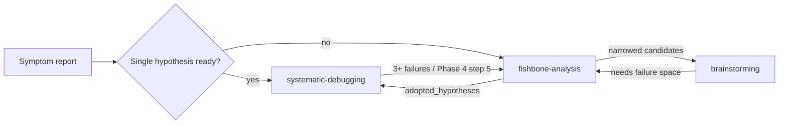

# Fishbone Analysis

## Overview

**Core principle:** Diverge across structurally independent perspectives BEFORE you converge on a hypothesis. Hand the adopted candidates back to convergent debugging.

This skill widens the cause space first, then yields adopted hypotheses for verification or redesign downstream.

## When to Use

- A user reports a symptom whose cause is unclear or could live in several places
- `systematic-debugging` has tried 3+ fixes and reached Phase 4 step 5 (architectural question)
- `brainstorming` needs to widen an existing system's failure space before redesign
- Pre-postmortem cause enumeration

## When NOT to Use

- A single hypothesis is already well-formed and reproducible → use **systematic-debugging**
- Designing a feature that does not yet exist → use **brainstorming**
- Obvious typo or one-line fix → direct edit
- Work is complete and being reviewed → use **requesting-code-review**

## Process

You MUST complete these steps in order.

### 1. Confirm input

- Read the problem statement.
- Determine `domain_hint`. If `auto`, infer from the problem text. If still unclear, ask one question.
- Load the matching preset from `category-presets.md`. Do not invent new categories.

### 2. Perspective-reset divergence

For EACH category in the preset, in order:

1. Output `### Perspective: <Category>` as a section header.
2. Read and internally apply that category's perspective prompt from `perspective-prompts.md`.
3. **Explicitly forget the previous category's hypotheses.** State internally: "Prior-category hypotheses do not exist for the purposes of this category."
4. Emit 3–7 hypotheses. Each MUST include `impact`, `verify_cost`, `confidence`, `evidence_needed`, `next_action`.
5. Move on. **Do not edit any prior category.** If a new perspective surfaces something that belongs to a prior category, mark it `cross_category` instead of going back.

### 3. Consolidation pass (once, after all categories)

- Merge hypotheses pointing to the same root cause. Flag the merged record as `cross_category`.
- Surface mutually exclusive pairs as a paired item.

### 4. Render the artifact

Emit a single self-contained HTML file at `agents/human/fishbone-<slug>.html`. Use `render-fishbone.html.template` as the base. Substitute the structured JSON into `<script type="application/json" id="fb-data">`. Translate UI strings to the user's native language when needed; the template defaults to English.

Also write the raw structured JSON to `agents/tasks/active/fishbone-<slug>.json` for machine consumption.

The emitted HTML MUST include:

- SVG fishbone drawn from the JSON
- Per-hypothesis **adopt / hold / reject** toggles, persisted in `localStorage`
- Priority quadrant (impact × verify_cost)
- Auto-aggregated next-action list for adopted items
- Generated follow-up prompt with a copy button, so the user can hand the adopted set back to `systematic-debugging` or `brainstorming`

### 5. Handoff

- Invoked from another skill: return `adopted_hypotheses[]` to the caller after the user finishes adoption.
- Invoked directly: wait for the user to confirm which hypotheses to verify next.
- Zero hypotheses adopted: offer two paths — re-expand with a different `domain_hint`, or escalate to **brainstorming** for redesign.

## Input

```json
{
  "problem": "string (one-line symptom)",
  "context": "string?",
  "domain_hint": "software | manufacturing | ops | human-process | auto",
  "categories": "string[]?"
}
```

## Output

```json
{
  "artifact_path": "agents/human/fishbone-<slug>.html",
  "structured_path": "agents/tasks/active/fishbone-<slug>.json",
  "adopted_hypotheses": [
    {
      "id": "string",
      "category": "string",
      "hypothesis": "string",
      "impact": "low | med | high",
      "verify_cost": "low | med | high",
      "confidence": "low | med | high",
      "evidence_needed": "string",
      "next_action": "string"
    }
  ]
}
```

## Quick Reference

| Field | Values | Meaning |
|---|---|---|
| `impact` | low / med / high | Damage if this is the real cause |
| `verify_cost` | low / med / high | Effort to confirm or refute |
| `confidence` | low / med / high | Current estimate of likelihood |
| `evidence_needed` | string | Logs, traces, or repro conditions to gather |
| `next_action` | string | First concrete step if adopted |

Prioritize hypotheses with `impact=high && verify_cost=low`.

## Boundary with Adjacent Skills



This skill is the **divergence stage**. It sits in front of verification (`systematic-debugging`) and redesign (`brainstorming`), and feeds either of them.

## Common Mistakes

| Mistake | Fix |
|---|---|
| Inventing new categories on the fly | Stick to the preset. Override only on explicit user request. |
| Mixing "the fix" into a hypothesis | Hypothesis = cause. Put the action in `next_action`. |
| Emitting 10+ hypotheses in one category | Cap at 7. More dilutes the perspective. |
| Carrying prior-category hypotheses forward | Use the explicit forget step in §2 step 3. |
| Returning to a prior category to "improve" it | Forbidden. Use `cross_category` flag instead. |
| Trying to render the fishbone with Mermaid | Mermaid has no fishbone syntax. Generate SVG from JSON in the template. |
| Listing hypotheses inline in chat instead of HTML | The HTML is the deliverable. The user needs the `localStorage` triage UI and the generated handoff prompt. |

## Red Flags — STOP

- "Let me just enumerate everything in one big list" → split by category
- "This hypothesis also fits the previous category, let me edit that one too" → use `cross_category`, do not edit
- "I'll propose a hypothesis and the fix together" → separate them; action belongs in `next_action`
- "Mermaid should be able to render this" → it cannot; use the SVG template
- "Let me skip the HTML and just list hypotheses in chat" → the HTML is the deliverable
- "I already know what the cause is" → if the cause is truly single and reproducible, hand off to `systematic-debugging` instead of running this skill

## Supporting Files

- `category-presets.md` — fixed category lists per `domain_hint`
- `perspective-prompts.md` — per-category isolation prompts (`ONLY:` / `NOT:` rules)
- `render-fishbone.html.template` — single-file HTML output template, data-driven from `<script id="fb-data">`
